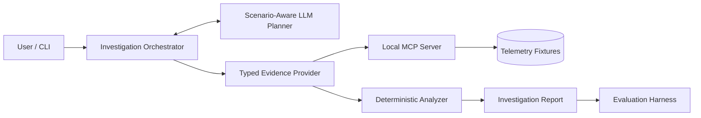

# DataOps Investigator 🕵️‍♂️ 📊

> An evidence-driven AI agent for investigating and diagnosing data-system incidents.

## 📌 Overview

**DataOps Investigator** turns data-engineering incidents into structured, evidence-backed investigations.

Instead of allowing an LLM to freely infer root causes, the system follows a strict principle:

> **The model plans. Tools collect facts. Deterministic analyzers diagnose.**

The planner decides which approved evidence to collect, MCP-backed tools retrieve typed telemetry, and scenario-specific deterministic analyzers evaluate the evidence before producing a diagnosis.

The current MVP supports Spark performance regressions, pipeline failures caused by schema drift, SQL query performance regressions, and data quality anomalies.

### Key Features

* **Agentic Planning** — A scenario-aware LLM creates bounded evidence-collection plans.
* **Deterministic Diagnosis** — Root-cause hypotheses are evaluated using scenario-specific rules rather than free-form LLM reasoning.
* **MCP Evidence Layer** — Local MCP tools expose typed runtime evidence while keeping transport separate from diagnosis logic.
* **Dual Execution Modes** — Run investigations deterministically without an LLM or through the agentic planner.
* **Strict Guardrails** — Scenario-specific tool allowlists, required tools, bounded plans, duplicate/unknown-tool rejection, and read-only execution.
* **Evaluation-Driven** — Deterministic and agentic evaluation harnesses verify diagnosis quality, evidence coverage, and planner safety.

---

## 🔍 Supported Investigations

| Scenario                         | Evidence Collected                                                                  | Demonstrated Diagnosis |
| -------------------------------- | ----------------------------------------------------------------------------------- | ---------------------- |
| **Spark Performance Regression** | Runtime, input growth, partition skew, shuffle growth, spill, configuration changes | `DATA_SKEW`            |
| **Pipeline Failure**             | Run metadata, failure logs, current schema, historical schema                       | `SCHEMA_DRIFT`         |
| **Data Quality Anomaly**         | Partition statistics, dataset/table configurations, run volume                      | `INCOMPLETE_UPSTREAM_DATA` |
| **SQL Query Regression**         | Query plan nodes, logical operators, input/output row counts                        | `JOIN_CARDINALITY_EXPLOSION` |

For Pipeline Failure, `SCHEMA_DRIFT` is supported only when the detected schema change correlates with the actual failure evidence.

Example:

```text
Baseline Schema : customer_id = BIGINT
Current Schema  : customer_id = STRING
Failure Log     : Expected BIGINT, received STRING

Diagnosis       : SCHEMA_DRIFT
```

The system does not attribute the change to an upstream producer, deployment, or service unless evidence supporting that attribution is available.

---

## 🏗 Architecture

The architecture deliberately separates **agentic evidence acquisition** from **deterministic diagnosis**.



### Agentic Mode

```text
Incident
   ↓
LLM Planner
   ↓
Validated Tool Plan
   ↓
MCP Evidence Provider
   ↓
Typed Telemetry
   ↓
Deterministic Analyzer
   ↓
Evidence-Backed Diagnosis
```

### Deterministic Mode

```text
Incident
   ↓
Fixed Bounded Workflow
   ↓
Fixture Evidence Provider
   ↓
Typed Telemetry
   ↓
Deterministic Analyzer
   ↓
Evidence-Backed Diagnosis
```

Agentic mode changes **how evidence is collected**, not how that evidence is interpreted.

---

## 🛠 Tech Stack

* **Language:** Python 3
* **Data Validation:** Pydantic
* **Agentic Orchestration:** Custom typed workflow with explicit planning and validation
* **LLM Integration:** OpenAI-compatible API
* **Evidence Transport:** Model Context Protocol (`mcp`)
* **CLI:** Python command-line interface
* **Testing:** Pytest
* **Evaluation:** Deterministic scenario contracts + offline agentic evaluation

The project intentionally avoids introducing LangChain/LangGraph because the current investigation workflows require explicit control over planning, tool validation, evidence acquisition, and diagnosis boundaries.

---

## 🚀 How to Run

### Prerequisites

* Python 3
* An OpenAI-compatible LLM endpoint is required only for Agentic Mode

### 1. Setup

```bash
git clone https://github.com/pranavkapale/DataOps-Investigator.git
cd dataops-investigator

python -m venv venv
source venv/bin/activate

pip install -r requirements.txt

cp .env.example .env
```

Configure the LLM settings in `.env` if you want to use Agentic Mode:

```text
LLM_API_KEY=...
LLM_API_BASE=...
LLM_MODEL=...
```

### 2. Spark Performance Investigation

#### Deterministic

```bash
python -m app.cli investigate spark_performance run-customer-aggregation-2026-08-28
```

#### Agentic

```bash
python -m app.cli investigate spark_performance run-customer-aggregation-2026-08-28 --agentic
```

### 3. Pipeline Failure Investigation

#### Deterministic

```bash
python -m app.cli investigate pipeline_failure run-customer-daily-2026-09-12
```

#### Agentic

```bash
python -m app.cli investigate pipeline_failure run-customer-daily-2026-09-12 --agentic
```

### 4. Data Quality Anomaly

#### Deterministic

```bash
python -m app.cli investigate data_quality dq-run-2026-09-20
```

### 5. SQL Query Regression

#### Deterministic

```bash
python -m app.cli investigate sql_regression sql-query-101
```

### JSON Output

Append `--json` to return the serialized `InvestigationReport`:

```bash
python -m app.cli investigate pipeline_failure run-customer-daily-2026-09-12 --json
```

---

## 💡 Example Investigation Output

### Spark Performance Regression

```text
Investigation Type: spark_performance
Run ID: run-customer-aggregation-2026-08-28
Status: COMPLETED

ACTUAL EVIDENCE:

runtime_regression_ratio: 4.00
input_growth_ratio: 1.08
skew_ratio: ~11.03
shuffle_write_growth_ratio: ~4.11

Leading Root Cause: Data Skew
Confidence: 0.90
```

The runtime increased approximately 4× while input volume increased only modestly. The much larger partition skew and shuffle growth provide stronger evidence for `DATA_SKEW` than simple input-volume growth.

### Pipeline Failure

```text
Investigation Type: pipeline_failure
Run ID: run-customer-daily-2026-09-12
Status: COMPLETED

ACTUAL EVIDENCE:

Schema drifted fields:
customer_id (BIGINT -> STRING)

Leading Root Cause: Schema Drift
```

The analyzer correlates the historical/current schema difference with the field and type mismatch reported in the actual failure log.

### Data Quality Anomaly

```text
Investigation Type: data_quality
Run ID: dq-run-2026-09-20
Status: COMPLETED

ACTUAL EVIDENCE:

missing_partition_count: 9
revenue_ratio: 0.65

Leading Root Cause: Incomplete Upstream Data
Confidence: 0.95
```

The analyzer observes missing partitions and identifies that the 35% drop in revenue is likely due to the upstream ingestion failure rather than a genuine business event.

### SQL Query Regression

```text
Investigation Type: sql_regression
Run ID: sql-query-101
Status: COMPLETED

ACTUAL EVIDENCE:

join_expansion_ratio: 4975.12

Leading Root Cause: Join Cardinality Explosion
Confidence: 0.98
```

The analyzer traces the regression directly to a `JOIN` node where the output row count unexpectedly exceeded the combined input row count by several orders of magnitude compared to the historical baseline.

---

## 🛡 Guardrails

Before any agentic evidence collection occurs:

* Tools must belong to the scenario-specific allowlist.
* All required tools must be included.
* Duplicate tools are rejected.
* Unknown tools are rejected.
* Plans are bounded to a maximum number of steps.
* Invalid plans execute zero evidence calls.
* Runtime components cannot read `expected_diagnosis.json`.
* Investigation tools are read-only.

The MVP investigates and recommends. It does not modify data, jobs, schemas, configuration, or infrastructure.

---

## 🧪 Evaluation

The project evaluates two separate concerns.

### Deterministic Evaluation

Checks whether the investigation produced the expected:

* root cause
* evidence
* derived metrics or schema changes
* hypothesis states

### Agentic Evaluation

Measures:

* valid and invalid plans
* required-tool coverage
* unsafe or unknown tools
* duplicate tools
* planner request failures
* plan validation failures
* provider failures
* investigation failures
* root-cause correctness
* evidence coverage

External LLM transport failures are tracked separately from invalid planning decisions.

---

## 🧪 Testing

The project includes deterministic tests across both investigation scenarios and equivalence checks between deterministic and agentic execution paths.

Coverage includes:

* domain models
* scenario fixtures
* evidence providers
* deterministic analyzers
* investigation workflows
* MCP tools
* MCP provider equivalence and lifecycle
* planner validation and guardrails
* agentic workflows
* deterministic evaluation
* agentic evaluation
* CLI behavior

**Current verified result: 147 tests passing.**

Run the full suite:

```bash
python -m pytest -q
```

---

## ⚖️ Engineering Trade-Offs

### Why deterministic diagnosis?

Operational diagnoses should be reproducible and traceable to measured evidence rather than depend on free-form LLM reasoning.

### Why scenario-specific analyzers?

Spark performance regression and pipeline schema failures require fundamentally different telemetry and diagnostic logic.

### Why fixture-first?

Fixtures allow repeatable investigations, negative test cases, provider-equivalence testing, and evaluation without requiring live infrastructure.

### Why MCP?

MCP separates evidence transport from diagnostic semantics while preserving the same typed provider contracts.

### Why no generic agent framework?

The project deliberately waits for demonstrated reuse before introducing broad abstractions. Scenario-specific workflows remain easier to understand and validate at the current scale.

---

## ⚠️ Current Limitations

* Evidence currently comes from deterministic local telemetry fixtures rather than live Spark, Databricks, Airflow, or cloud integrations.
* Real LLM evaluation depends on external model availability and is excluded from the deterministic automated test suite.
* Some agentic evaluation errors are currently classified using exception-message inspection.
* Spark and Pipeline MCP providers contain duplicated local stdio session-lifecycle logic.
* Investigation status does not yet fully separate technical execution failure from an analytically inconclusive result.

These are intentionally deferred MVP trade-offs rather than hidden production assumptions.
